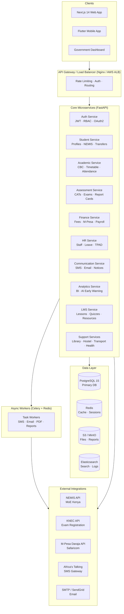
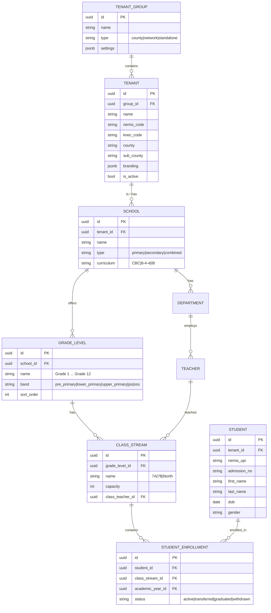
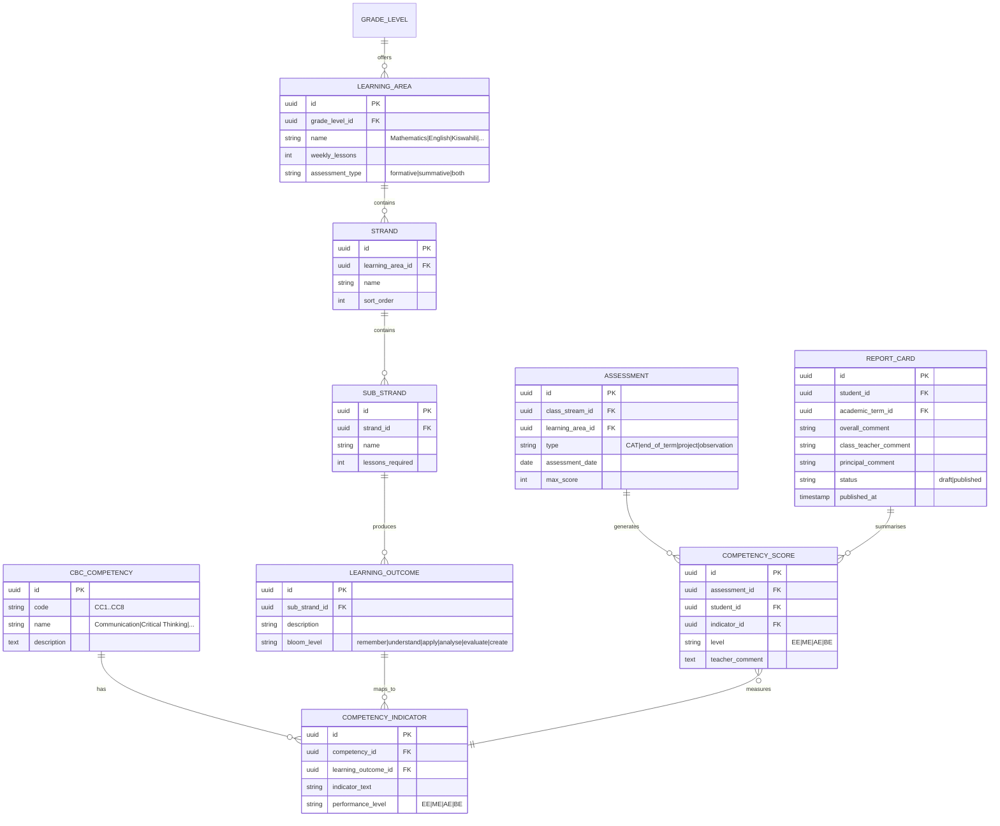
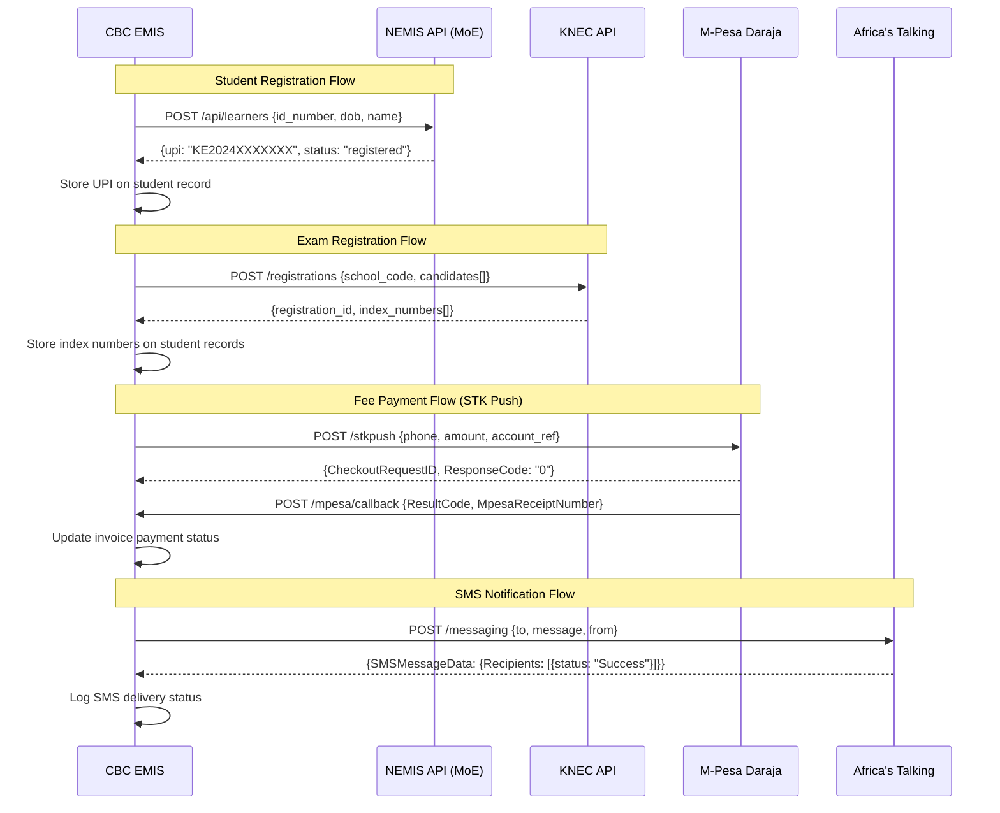
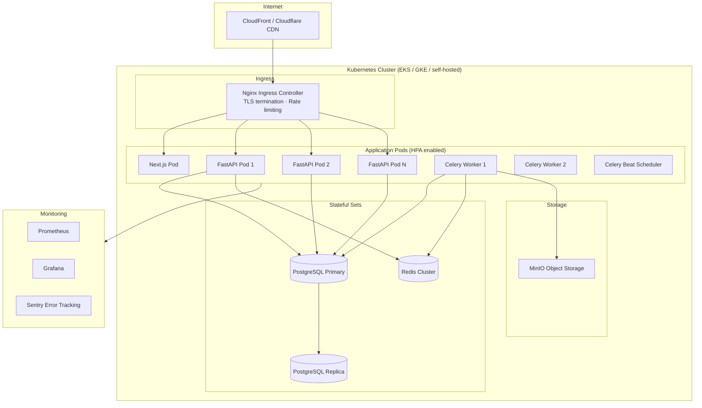
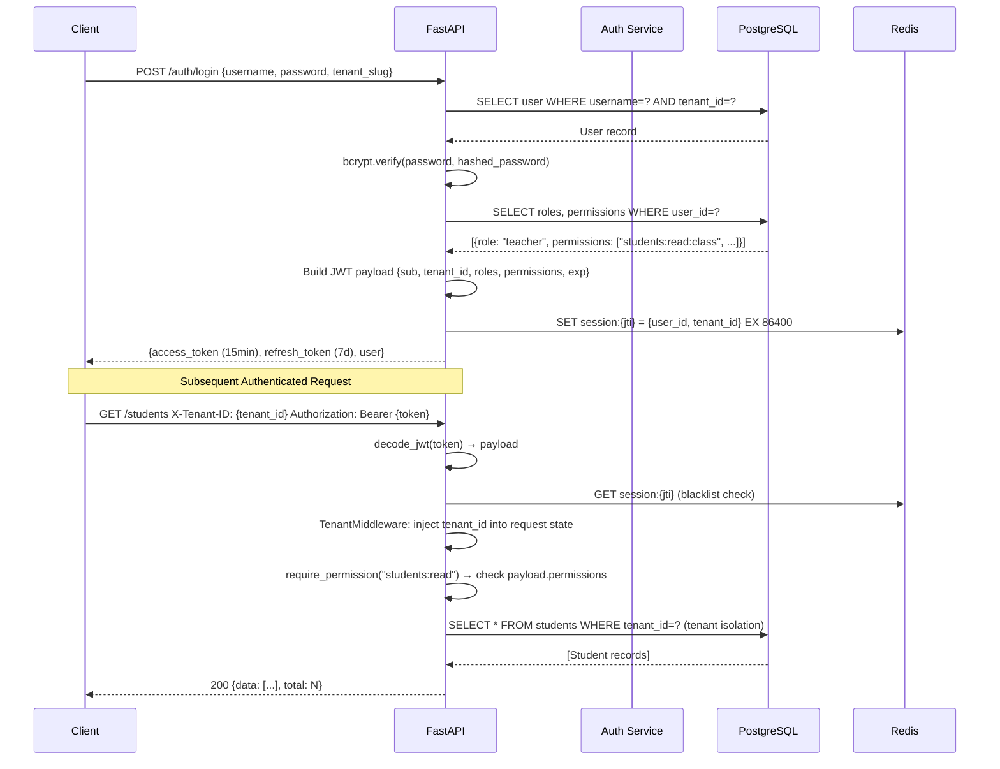
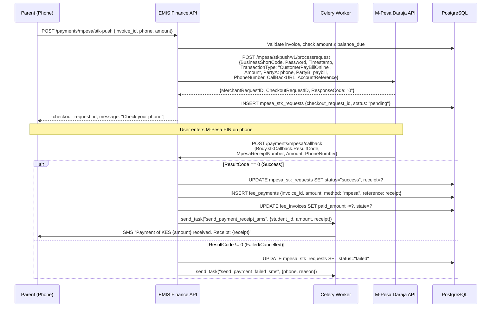
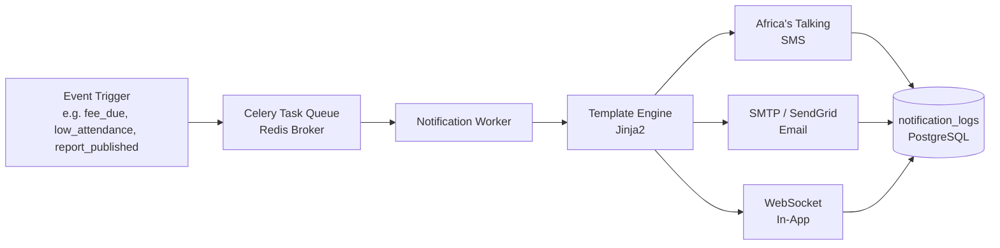

# Design Document: CBC EMIS Kenya

## Overview

A world-class, CBC-compliant Educational Management Information System (EMIS) for Kenyan schools covering
Pre-Primary through Grade 12/13. The system is a multi-tenant SaaS platform built on the existing
FastAPI + PostgreSQL backend, extended with a Next.js 14 frontend and Flutter mobile app. It integrates
Kenya-specific systems (NEMIS, KNEC, M-Pesa, Africa's Talking) and implements all 8 CBC competency areas
across 40+ modules serving 15 distinct user roles.

The platform borrows best-in-class features from PowerSchool (SIS depth), Canvas/Moodle (LMS), Blackbaud
(finance), Skyward (parent portal), and Edsby (CBC-style competency reporting), unified into a single
Kenya-specific product. The existing codebase (FastAPI, SQLAlchemy, PostgreSQL, JWT auth, 5 roles, ~20
models) forms the foundation; this design describes the full target architecture and the migration path
from the current state.

---

## Part 1: High-Level Design

### 1.1 System Architecture




### 1.2 Multi-Tenant Data Model




### 1.3 Microservices Breakdown

| Service | Responsibility | Key Models | Existing Coverage |
|---|---|---|---|
| **Auth Service** | JWT issuance, RBAC, OAuth2, session management, 15-role enforcement | User, Role, Permission, RolePermission, TenantUser | Partial (5 roles, no RBAC table) |
| **Student Service** | Student profiles, NEMIS sync, admissions, transfers, alumni, discipline | Student, Enrollment, Parent, Admission, Transfer, DisciplineRecord | Partial (Student, Parent, Admission) |
| **Academic Service** | CBC curriculum, grade levels, streams, timetable, attendance, academic calendar | GradeLevel, ClassStream, LearningArea, Strand, SubStrand, Timetable, Attendance | Partial (Course, Batch, Timetable, Attendance) |
| **Assessment Service** | CATs, end-of-term exams, KNEC registration, CBC report cards, grade book, rubrics | Assessment, AssessmentResult, CompetencyScore, ReportCard, Rubric | Partial (Exam, Assignment) |
| **Finance Service** | Fee structures, invoices, M-Pesa STK Push, scholarships, payroll, expense tracking | FeeStructure, Invoice, Payment, MpesaTransaction, Scholarship, Payroll | Partial (Fees, FeePayment) |
| **HR Service** | Staff profiles, TSC numbers, leave, TPAD appraisals, professional development | StaffProfile, LeaveRequest, TPADAppraisal, ProfessionalDevelopment | None |
| **Communication Service** | SMS (Africa's Talking), email, in-app notices, events, parent-teacher messaging | Notification, Message, NoticeBoard, Event, MessageThread | None |
| **Analytics Service** | Enrollment trends, performance analytics, attendance heatmaps, AI early warning | AnalyticsSnapshot, AtRiskFlag, GovernmentReport | None |
| **LMS Service** | Online lessons, quizzes, assignments, digital resources, DigiGuide | Lesson, Quiz, QuizAttempt, DigitalResource, CareerGuidance | Partial (Assignment, LMS modules) |
| **Support Services** | Library, hostel, transport, health, inventory | Book, BorrowRecord, Room, BoarderRecord, Route, Vehicle, MedicalRecord | Partial (Library, Hostel, Transport, Health) |


### 1.4 RBAC Permission Matrix (15 Roles × Key Actions)

Permissions follow the pattern `resource:action`. The table below shows the 15 roles and their access
across the major resource groups. ✅ = full access, 📖 = read-only, ✏️ = own records only, ❌ = no access.

| Role | Students | Academics | Assessment | Finance | HR | Communication | Analytics | System Config |
|---|---|---|---|---|---|---|---|---|
| Super Admin | ✅ | ✅ | ✅ | ✅ | ✅ | ✅ | ✅ | ✅ |
| School Admin / Principal | ✅ | ✅ | ✅ | ✅ | ✅ | ✅ | ✅ | ✅ (school) |
| Academic Director | 📖 | ✅ | ✅ | ❌ | 📖 | ✏️ | ✅ | ✏️ (academic) |
| Teacher | ✏️ (class) | ✏️ (own) | ✅ (own class) | ❌ | ✏️ (own) | ✏️ | 📖 (own class) | ❌ |
| Student | ✏️ (own) | 📖 (own) | 📖 (own) | 📖 (own) | ❌ | ✏️ | ❌ | ❌ |
| Parent / Guardian | 📖 (child) | 📖 (child) | 📖 (child) | 📖 (child) | ❌ | ✏️ | ❌ | ❌ |
| Finance Officer | 📖 | ❌ | ❌ | ✅ | ✏️ (payroll) | ✏️ | 📖 (finance) | ✏️ (finance) |
| Registrar | ✅ | 📖 | 📖 | 📖 | ❌ | ✏️ | 📖 | ✏️ (admissions) |
| Librarian | 📖 | ❌ | ❌ | ❌ | ❌ | ✏️ | 📖 (library) | ✏️ (library) |
| Transport Manager | 📖 | ❌ | ❌ | 📖 | ❌ | ✏️ | 📖 (transport) | ✅ (transport) |
| HR Manager | 📖 | ❌ | ❌ | ✏️ (payroll) | ✅ | ✏️ | 📖 (HR) | ✏️ (HR) |
| Nurse / Health Officer | 📖 | ❌ | ❌ | ❌ | ❌ | ✏️ | 📖 (health) | ✅ (health) |
| Hostel Manager | 📖 | ❌ | ❌ | 📖 | ❌ | ✏️ | 📖 (hostel) | ✅ (hostel) |
| Security / Gate Officer | 📖 (basic) | ❌ | ❌ | ❌ | ❌ | ✏️ | ❌ | ✏️ (gate) |
| Government Dashboard | 📖 (aggregate) | 📖 (aggregate) | 📖 (aggregate) | 📖 (aggregate) | ❌ | ❌ | ✅ (read) | ❌ |

**RBAC Implementation**: Permissions are stored in a `role_permissions` table. Each API endpoint
declares required permissions via a `require_permission("resource:action")` dependency. Tenant
isolation is enforced at the query level via a `tenant_id` filter injected by middleware.


### 1.5 Database Schema Overview

The full schema spans ~300+ tables across all modules. Below are the major entity groups and their
primary relationships.

**Core / Auth (~15 tables)**
`tenants`, `tenant_groups`, `users`, `roles`, `permissions`, `role_permissions`, `user_roles`,
`tenant_users`, `audit_logs`, `sessions`, `password_reset_tokens`, `oauth_tokens`,
`api_keys`, `system_settings`, `feature_flags`

**Student Lifecycle (~25 tables)**
`students`, `student_enrollments`, `student_transfers`, `student_documents`, `alumni`,
`discipline_records`, `discipline_actions`, `parent_guardian`, `student_parent_links`,
`admission_applications`, `admission_stages`, `admission_documents`, `student_categories`,
`student_medical_summary`, `student_achievements`, `student_awards`, `mentorship_assignments`,
`career_guidance_records`, `student_notes`, `student_tags`, `gate_log`, `visitor_log`,
`student_checkin_log`, `emergency_contacts`, `student_photos`

**CBC Curriculum (~20 tables)**
`grade_levels`, `class_streams`, `learning_areas`, `strands`, `sub_strands`,
`competency_indicators`, `cbc_competencies`, `learning_outcomes`, `lesson_plans`,
`curriculum_maps`, `academic_years`, `academic_terms`, `academic_calendar_events`,
`school_holidays`, `timetable_slots`, `timetable_entries`, `classroom_resources`,
`subject_teacher_assignments`, `learning_area_grade_map`, `curriculum_versions`

**Assessment (~20 tables)**
`assessments`, `assessment_types`, `assessment_results`, `competency_scores`,
`rubric_templates`, `rubric_criteria`, `rubric_scores`, `report_cards`,
`report_card_comments`, `grade_book_entries`, `exam_registrations`, `knec_registrations`,
`exam_timetables`, `exam_rooms`, `exam_invigilators`, `cat_schedules`,
`progress_reports`, `transcripts`, `assessment_attachments`, `moderation_records`

**Finance (~25 tables)**
`fee_structures`, `fee_structure_items`, `fee_invoices`, `fee_invoice_items`,
`fee_payments`, `mpesa_transactions`, `mpesa_stk_requests`, `mpesa_c2b_callbacks`,
`scholarships`, `scholarship_applications`, `bursaries`, `expense_categories`,
`expenses`, `expense_approvals`, `payroll_periods`, `payroll_entries`,
`payroll_deductions`, `payroll_allowances`, `bank_accounts`, `payment_methods`,
`financial_reports`, `budget_lines`, `budget_allocations`, `petty_cash`, `receipts`

**HR (~15 tables)**
`staff_profiles`, `staff_qualifications`, `staff_documents`, `leave_types`,
`leave_requests`, `leave_balances`, `tpad_appraisals`, `tpad_criteria`,
`professional_development`, `pd_attendance`, `staff_performance_reviews`,
`staff_contracts`, `staff_departments`, `staff_roles_history`, `staff_disciplinary`

**Communication (~10 tables)**
`notifications`, `notification_templates`, `sms_logs`, `email_logs`,
`notice_board_posts`, `events`, `event_attendees`, `message_threads`,
`messages`, `blog_posts`

**Support Modules (~50 tables)**
Library: `books`, `book_copies`, `borrow_records`, `book_categories`, `digital_resources`, `overdue_fines`
Transport: `vehicles`, `routes`, `route_stops`, `driver_assignments`, `student_routes`, `gps_logs`
Hostel: `dormitories`, `rooms`, `boarder_records`, `hostel_fees`, `hostel_discipline`
Health: `medical_records`, `sick_bay_visits`, `immunization_records`, `health_alerts`, `medical_conditions`
Inventory: `inventory_items`, `inventory_categories`, `stock_movements`, `purchase_orders`

**Analytics (~10 tables)**
`analytics_snapshots`, `at_risk_flags`, `enrollment_trends`, `performance_aggregates`,
`attendance_aggregates`, `fee_collection_summaries`, `government_reports`,
`county_dashboards`, `school_rankings`, `ai_model_outputs`


### 1.6 CBC Curriculum Data Model



**CBC Performance Levels:**
- **EE** — Exceeds Expectation (score ≥ 75%)
- **ME** — Meets Expectation (score 50–74%)
- **AE** — Approaches Expectation (score 25–49%)
- **BE** — Below Expectation (score < 25%)


### 1.7 Integration Architecture



**Integration Resilience:**
- All external API calls go through a `IntegrationService` with retry logic (exponential backoff, max 3 retries)
- Failed calls are queued in Celery for async retry
- Circuit breaker pattern prevents cascade failures
- All integration events are stored in `integration_logs` table for audit


### 1.8 Deployment Architecture



**Smaller School Option (Railway / Render):**
Single Docker Compose stack: `api`, `worker`, `postgres`, `redis`, `minio` — no K8s overhead.
Suitable for schools with < 2,000 students.

---

## Part 2: Low-Level Design

### 2.1 Core API Endpoint Specifications

All endpoints are prefixed `/api/v1/`. Authentication via `Authorization: Bearer <JWT>`.
Tenant isolation via `X-Tenant-ID` header (or subdomain routing).

#### Auth Endpoints
```
POST   /auth/login              → {access_token, refresh_token, user}
POST   /auth/refresh            → {access_token}
POST   /auth/logout             → 204
POST   /auth/forgot-password    → 204
POST   /auth/reset-password     → 204
GET    /auth/me                 → UserProfile
```

#### Student Endpoints
```
GET    /students                → PaginatedList[StudentOut]
POST   /students                → StudentOut
GET    /students/{id}           → StudentOut
PUT    /students/{id}           → StudentOut
DELETE /students/{id}           → 204
POST   /students/{id}/nemis-sync → {upi, status}
POST   /students/{id}/transfer  → TransferOut
GET    /students/{id}/report-cards → List[ReportCardOut]
GET    /students/{id}/attendance-summary → AttendanceSummary
GET    /students/{id}/fee-balance → FeeBalance
```

#### CBC Academic Endpoints
```
GET    /grade-levels            → List[GradeLevelOut]
GET    /class-streams           → List[ClassStreamOut]
POST   /class-streams           → ClassStreamOut
GET    /learning-areas          → List[LearningAreaOut]
GET    /strands                 → List[StrandOut]
GET    /sub-strands             → List[SubStrandOut]
GET    /competencies            → List[CBCCompetencyOut]
```

#### Assessment Endpoints
```
GET    /assessments             → PaginatedList[AssessmentOut]
POST   /assessments             → AssessmentOut
POST   /assessments/{id}/scores → List[CompetencyScoreOut]
GET    /assessments/{id}/scores → List[CompetencyScoreOut]
POST   /report-cards/generate   → {task_id}  (async)
GET    /report-cards/{id}       → ReportCardOut
GET    /report-cards/{id}/pdf   → PDF stream
POST   /report-cards/{id}/publish → ReportCardOut
```

#### Finance Endpoints
```
GET    /fee-structures          → List[FeeStructureOut]
POST   /fee-structures          → FeeStructureOut
POST   /invoices/bulk-generate  → {task_id}  (async)
GET    /invoices/{id}           → InvoiceOut
POST   /payments/mpesa/stk-push → {checkout_request_id}
POST   /payments/mpesa/callback → 200  (Safaricom webhook)
GET    /payments/mpesa/status/{checkout_id} → MpesaStatusOut
GET    /finance/reports/collection → CollectionReportOut
```

#### Timetable Endpoints (extends existing)
```
GET    /timetable/slots         → List[TimetableSlotOut]
POST   /timetable/generate      → {task_id}  (async, constraint solver)
GET    /timetable/{stream_id}   → WeeklyTimetableOut
POST   /timetable/entries       → TimetableEntryOut
PUT    /timetable/entries/{id}  → TimetableEntryOut
```

#### Attendance Endpoints (extends existing)
```
POST   /attendance/daily        → AttendanceSessionOut
POST   /attendance/lesson       → AttendanceSessionOut
GET    /attendance/class/{stream_id}/date/{date} → ClassAttendanceOut
GET    /attendance/student/{id}/summary → AttendanceSummaryOut
POST   /attendance/bulk         → {recorded: int}
```

#### Communication Endpoints
```
POST   /notifications/sms       → {task_id}
POST   /notifications/email     → {task_id}
POST   /notices                 → NoticeOut
GET    /notices                 → List[NoticeOut]
POST   /messages                → MessageOut
GET    /messages/threads        → List[ThreadOut]
```

#### WebSocket Endpoints (real-time)
```
WS     /ws/notifications        → real-time notification stream per user
WS     /ws/attendance/{stream_id} → live attendance marking feed
WS     /ws/gate                 → gate officer check-in/out stream
```


### 2.2 Key Database Table Schemas (DDL)

```sql
-- ─── TENANTS ──────────────────────────────────────────────────────────────────
CREATE TABLE tenants (
    id          UUID PRIMARY KEY DEFAULT gen_random_uuid(),
    group_id    UUID REFERENCES tenant_groups(id),
    name        VARCHAR(200) NOT NULL,
    slug        VARCHAR(100) UNIQUE NOT NULL,
    nemis_code  VARCHAR(20) UNIQUE,
    knec_code   VARCHAR(20),
    county      VARCHAR(100),
    sub_county  VARCHAR(100),
    branding    JSONB DEFAULT '{}',
    settings    JSONB DEFAULT '{}',
    is_active   BOOLEAN DEFAULT TRUE,
    created_at  TIMESTAMPTZ DEFAULT NOW()
);

-- ─── USERS (extended from current) ───────────────────────────────────────────
CREATE TABLE users (
    id              UUID PRIMARY KEY DEFAULT gen_random_uuid(),
    tenant_id       UUID NOT NULL REFERENCES tenants(id),
    email           VARCHAR(255) UNIQUE NOT NULL,
    username        VARCHAR(100) UNIQUE NOT NULL,
    hashed_password VARCHAR(255) NOT NULL,
    first_name      VARCHAR(100),
    last_name       VARCHAR(100),
    phone           VARCHAR(20),
    is_active       BOOLEAN DEFAULT TRUE,
    is_superuser    BOOLEAN DEFAULT FALSE,
    last_login      TIMESTAMPTZ,
    created_at      TIMESTAMPTZ DEFAULT NOW(),
    updated_at      TIMESTAMPTZ
);

CREATE TABLE roles (
    id          UUID PRIMARY KEY DEFAULT gen_random_uuid(),
    tenant_id   UUID REFERENCES tenants(id),  -- NULL = system-wide role
    name        VARCHAR(50) NOT NULL,
    code        VARCHAR(50) NOT NULL,  -- super_admin|school_admin|teacher|...
    description TEXT,
    UNIQUE(tenant_id, code)
);

CREATE TABLE permissions (
    id          UUID PRIMARY KEY DEFAULT gen_random_uuid(),
    resource    VARCHAR(100) NOT NULL,  -- students|assessments|finance|...
    action      VARCHAR(50) NOT NULL,   -- create|read|update|delete|publish
    scope       VARCHAR(50) DEFAULT 'tenant',  -- tenant|own|class|child
    UNIQUE(resource, action, scope)
);

CREATE TABLE role_permissions (
    role_id       UUID REFERENCES roles(id) ON DELETE CASCADE,
    permission_id UUID REFERENCES permissions(id) ON DELETE CASCADE,
    PRIMARY KEY (role_id, permission_id)
);

CREATE TABLE user_roles (
    user_id   UUID REFERENCES users(id) ON DELETE CASCADE,
    role_id   UUID REFERENCES roles(id) ON DELETE CASCADE,
    PRIMARY KEY (user_id, role_id)
);

-- ─── STUDENTS (extended) ──────────────────────────────────────────────────────
CREATE TABLE students (
    id                  UUID PRIMARY KEY DEFAULT gen_random_uuid(),
    tenant_id           UUID NOT NULL REFERENCES tenants(id),
    nemis_upi           VARCHAR(20) UNIQUE,
    admission_no        VARCHAR(50) NOT NULL,
    first_name          VARCHAR(100) NOT NULL,
    middle_name         VARCHAR(100),
    last_name           VARCHAR(100) NOT NULL,
    gender              VARCHAR(10) CHECK (gender IN ('male','female','other')),
    date_of_birth       DATE NOT NULL,
    blood_group         VARCHAR(5),
    nationality         VARCHAR(100) DEFAULT 'Kenyan',
    county_of_origin    VARCHAR(100),
    sub_county          VARCHAR(100),
    religion            VARCHAR(50),
    special_needs       BOOLEAN DEFAULT FALSE,
    special_needs_notes TEXT,
    photo_url           VARCHAR(500),
    is_boarder          BOOLEAN DEFAULT FALSE,
    is_active           BOOLEAN DEFAULT TRUE,
    created_at          TIMESTAMPTZ DEFAULT NOW(),
    updated_at          TIMESTAMPTZ,
    UNIQUE(tenant_id, admission_no)
);

-- ─── CBC CURRICULUM ───────────────────────────────────────────────────────────
CREATE TABLE grade_levels (
    id          UUID PRIMARY KEY DEFAULT gen_random_uuid(),
    tenant_id   UUID NOT NULL REFERENCES tenants(id),
    name        VARCHAR(50) NOT NULL,  -- 'Grade 1', 'Grade 7', 'PP1'
    band        VARCHAR(30) NOT NULL,  -- pre_primary|lower_primary|upper_primary|jss|sss
    sort_order  INT NOT NULL,
    UNIQUE(tenant_id, name)
);

CREATE TABLE learning_areas (
    id              UUID PRIMARY KEY DEFAULT gen_random_uuid(),
    grade_level_id  UUID NOT NULL REFERENCES grade_levels(id),
    name            VARCHAR(200) NOT NULL,
    code            VARCHAR(20),
    weekly_lessons  INT DEFAULT 5,
    is_compulsory   BOOLEAN DEFAULT TRUE,
    UNIQUE(grade_level_id, name)
);

CREATE TABLE strands (
    id              UUID PRIMARY KEY DEFAULT gen_random_uuid(),
    learning_area_id UUID NOT NULL REFERENCES learning_areas(id),
    name            VARCHAR(200) NOT NULL,
    sort_order      INT DEFAULT 0
);

CREATE TABLE sub_strands (
    id          UUID PRIMARY KEY DEFAULT gen_random_uuid(),
    strand_id   UUID NOT NULL REFERENCES strands(id),
    name        VARCHAR(200) NOT NULL,
    sort_order  INT DEFAULT 0,
    lessons_required INT DEFAULT 1
);

-- ─── ASSESSMENTS ──────────────────────────────────────────────────────────────
CREATE TABLE assessments (
    id              UUID PRIMARY KEY DEFAULT gen_random_uuid(),
    tenant_id       UUID NOT NULL REFERENCES tenants(id),
    class_stream_id UUID NOT NULL REFERENCES class_streams(id),
    learning_area_id UUID NOT NULL REFERENCES learning_areas(id),
    teacher_id      UUID NOT NULL REFERENCES users(id),
    type            VARCHAR(30) NOT NULL,  -- CAT|end_of_term|project|observation
    title           VARCHAR(200) NOT NULL,
    assessment_date DATE NOT NULL,
    max_score       INT NOT NULL DEFAULT 100,
    weight_percent  NUMERIC(5,2) DEFAULT 100,
    academic_term_id UUID REFERENCES academic_terms(id),
    status          VARCHAR(20) DEFAULT 'draft',  -- draft|open|closed|moderated
    created_at      TIMESTAMPTZ DEFAULT NOW()
);

CREATE TABLE competency_scores (
    id              UUID PRIMARY KEY DEFAULT gen_random_uuid(),
    assessment_id   UUID NOT NULL REFERENCES assessments(id),
    student_id      UUID NOT NULL REFERENCES students(id),
    indicator_id    UUID REFERENCES competency_indicators(id),
    raw_score       NUMERIC(6,2),
    performance_level VARCHAR(2) CHECK (performance_level IN ('EE','ME','AE','BE')),
    teacher_comment TEXT,
    created_at      TIMESTAMPTZ DEFAULT NOW(),
    UNIQUE(assessment_id, student_id, indicator_id)
);

-- ─── MPESA TRANSACTIONS ───────────────────────────────────────────────────────
CREATE TABLE mpesa_stk_requests (
    id                  UUID PRIMARY KEY DEFAULT gen_random_uuid(),
    tenant_id           UUID NOT NULL REFERENCES tenants(id),
    invoice_id          UUID REFERENCES fee_invoices(id),
    phone_number        VARCHAR(15) NOT NULL,
    amount              NUMERIC(12,2) NOT NULL,
    account_reference   VARCHAR(100) NOT NULL,
    checkout_request_id VARCHAR(200) UNIQUE,
    merchant_request_id VARCHAR(200),
    response_code       VARCHAR(10),
    response_description TEXT,
    status              VARCHAR(20) DEFAULT 'pending',  -- pending|success|failed|cancelled
    mpesa_receipt_no    VARCHAR(50),
    transaction_date    TIMESTAMPTZ,
    created_at          TIMESTAMPTZ DEFAULT NOW()
);

-- ─── ATTENDANCE ───────────────────────────────────────────────────────────────
CREATE TABLE attendance_sessions (
    id              UUID PRIMARY KEY DEFAULT gen_random_uuid(),
    tenant_id       UUID NOT NULL REFERENCES tenants(id),
    class_stream_id UUID NOT NULL REFERENCES class_streams(id),
    teacher_id      UUID NOT NULL REFERENCES users(id),
    session_type    VARCHAR(20) NOT NULL,  -- daily|lesson
    session_date    DATE NOT NULL,
    period_number   INT,  -- NULL for daily, 1-8 for lesson
    learning_area_id UUID REFERENCES learning_areas(id),
    created_at      TIMESTAMPTZ DEFAULT NOW(),
    UNIQUE(class_stream_id, session_date, session_type, period_number)
);

CREATE TABLE attendance_records (
    id              UUID PRIMARY KEY DEFAULT gen_random_uuid(),
    session_id      UUID NOT NULL REFERENCES attendance_sessions(id),
    student_id      UUID NOT NULL REFERENCES students(id),
    status          VARCHAR(20) NOT NULL CHECK (status IN ('present','absent','late','excused')),
    reason          TEXT,
    marked_at       TIMESTAMPTZ DEFAULT NOW(),
    UNIQUE(session_id, student_id)
);
```


### 2.3 Authentication & Authorization Flow



**Key security properties:**
- JWT access tokens expire in 15 minutes; refresh tokens in 7 days
- Token blacklisting via Redis JTI store (logout invalidates immediately)
- All DB queries include `tenant_id` filter — enforced by `TenantQueryMixin`
- Permissions embedded in JWT to avoid per-request DB lookups
- Superuser bypass only available to `is_superuser=True` users at system level

```python
# app/core/security.py (extended)
from typing import Optional
from datetime import datetime, timedelta
from jose import jwt, JWTError
from passlib.context import CryptContext
from app.core.config import settings

pwd_context = CryptContext(schemes=["bcrypt"], deprecated="auto")

def create_access_token(
    subject: str,
    tenant_id: str,
    roles: list[str],
    permissions: list[str],
    expires_delta: Optional[timedelta] = None,
) -> str:
    expire = datetime.utcnow() + (expires_delta or timedelta(minutes=15))
    payload = {
        "sub": subject,
        "tenant_id": tenant_id,
        "roles": roles,
        "permissions": permissions,
        "exp": expire,
        "iat": datetime.utcnow(),
        "jti": str(uuid4()),
    }
    return jwt.encode(payload, settings.SECRET_KEY, algorithm="HS256")

# app/api/deps.py (extended)
def require_permission(resource: str, action: str, scope: str = "tenant"):
    """FastAPI dependency factory for permission checks."""
    def _check(current_user: TokenPayload = Depends(get_current_token)) -> TokenPayload:
        perm = f"{resource}:{action}:{scope}"
        if perm not in current_user.permissions and not current_user.is_superuser:
            raise HTTPException(403, f"Permission denied: {perm}")
        return current_user
    return _check

# Usage on endpoint:
@router.get("/students", dependencies=[Depends(require_permission("students", "read"))])
async def list_students(...): ...
```


### 2.4 M-Pesa Payment Flow (STK Push)



```python
# app/services/mpesa_service.py
import base64
from datetime import datetime
from httpx import AsyncClient
from app.core.config import settings

class MpesaService:
    BASE_URL = "https://api.safaricom.co.ke"  # sandbox: sandbox.safaricom.co.ke

    async def get_access_token(self) -> str:
        credentials = base64.b64encode(
            f"{settings.MPESA_CONSUMER_KEY}:{settings.MPESA_CONSUMER_SECRET}".encode()
        ).decode()
        async with AsyncClient() as client:
            resp = await client.get(
                f"{self.BASE_URL}/oauth/v1/generate?grant_type=client_credentials",
                headers={"Authorization": f"Basic {credentials}"},
            )
            return resp.json()["access_token"]

    def _generate_password(self, timestamp: str) -> str:
        raw = f"{settings.MPESA_SHORTCODE}{settings.MPESA_PASSKEY}{timestamp}"
        return base64.b64encode(raw.encode()).decode()

    async def stk_push(self, phone: str, amount: int, account_ref: str, description: str) -> dict:
        token = await self.get_access_token()
        timestamp = datetime.now().strftime("%Y%m%d%H%M%S")
        payload = {
            "BusinessShortCode": settings.MPESA_SHORTCODE,
            "Password": self._generate_password(timestamp),
            "Timestamp": timestamp,
            "TransactionType": "CustomerPayBillOnline",
            "Amount": amount,
            "PartyA": phone,
            "PartyB": settings.MPESA_SHORTCODE,
            "PhoneNumber": phone,
            "CallBackURL": f"{settings.BASE_URL}/api/v1/payments/mpesa/callback",
            "AccountReference": account_ref,
            "TransactionDesc": description,
        }
        async with AsyncClient() as client:
            resp = await client.post(
                f"{self.BASE_URL}/mpesa/stkpush/v1/processrequest",
                json=payload,
                headers={"Authorization": f"Bearer {token}"},
            )
            return resp.json()
```


### 2.5 CBC Report Card Generation Algorithm

```python
# app/services/report_card_service.py
from dataclasses import dataclass
from typing import Optional
from uuid import UUID

@dataclass
class CompetencyResult:
    learning_area: str
    strand: str
    level: str          # EE | ME | AE | BE
    score_percent: float
    teacher_comment: str

@dataclass
class ReportCardData:
    student_id: UUID
    term_id: UUID
    results: list[CompetencyResult]
    attendance_percent: float
    class_teacher_comment: str
    principal_comment: str

def score_to_cbc_level(score_percent: float) -> str:
    """
    Preconditions:  0.0 <= score_percent <= 100.0
    Postconditions: returns one of 'EE', 'ME', 'AE', 'BE'
    """
    if score_percent >= 75:
        return "EE"   # Exceeds Expectation
    elif score_percent >= 50:
        return "ME"   # Meets Expectation
    elif score_percent >= 25:
        return "AE"   # Approaches Expectation
    else:
        return "BE"   # Below Expectation

async def generate_report_card(
    db: AsyncSession,
    student_id: UUID,
    term_id: UUID,
) -> ReportCardData:
    """
    Algorithm:
    1. Fetch all assessments for student in term, grouped by learning_area
    2. For each learning_area, compute weighted average score
    3. Convert average to CBC performance level
    4. Aggregate competency scores across all learning areas
    5. Fetch attendance summary for the term
    6. Compose ReportCardData and persist draft ReportCard
    7. Return data for PDF rendering

    Preconditions:
      - student is enrolled in an active class stream for the term
      - at least one assessment result exists for the student in the term
    Postconditions:
      - ReportCard record created with status='draft'
      - All CompetencyScore records linked to the report card
    Loop invariant (step 2):
      - For each learning_area processed, weighted_sum and total_weight are consistent
    """
    # Step 1: Fetch assessment results
    results = await db.execute(
        select(CompetencyScore, Assessment, LearningArea)
        .join(Assessment, CompetencyScore.assessment_id == Assessment.id)
        .join(LearningArea, Assessment.learning_area_id == LearningArea.id)
        .where(
            CompetencyScore.student_id == student_id,
            Assessment.academic_term_id == term_id,
            Assessment.status == "closed",
        )
    )

    # Step 2: Group by learning area and compute weighted average
    area_scores: dict[str, tuple[float, float]] = {}  # {area_name: (weighted_sum, total_weight)}
    for score, assessment, area in results:
        key = area.name
        weight = assessment.weight_percent / 100.0
        pct = (score.raw_score / assessment.max_score) * 100 if score.raw_score else 0
        if key not in area_scores:
            area_scores[key] = (0.0, 0.0)
        ws, tw = area_scores[key]
        area_scores[key] = (ws + pct * weight, tw + weight)

    # Step 3: Convert to CBC levels
    competency_results = []
    for area_name, (weighted_sum, total_weight) in area_scores.items():
        avg = weighted_sum / total_weight if total_weight > 0 else 0
        competency_results.append(CompetencyResult(
            learning_area=area_name,
            strand="",
            level=score_to_cbc_level(avg),
            score_percent=round(avg, 1),
            teacher_comment="",
        ))

    # Step 4: Fetch attendance
    attendance = await get_attendance_summary(db, student_id, term_id)

    # Step 5: Persist draft report card
    report_card = ReportCard(
        student_id=student_id,
        academic_term_id=term_id,
        status="draft",
    )
    db.add(report_card)
    await db.commit()

    return ReportCardData(
        student_id=student_id,
        term_id=term_id,
        results=competency_results,
        attendance_percent=attendance.percent,
        class_teacher_comment="",
        principal_comment="",
    )
```

**PDF Generation**: Uses `WeasyPrint` or `ReportLab` to render a CBC-compliant report card template.
The template is stored as an HTML/CSS file per school (customizable branding). Generated PDFs are
stored in MinIO/S3 and the URL is saved on the `ReportCard` record.


### 2.6 Attendance Tracking Data Model

```mermaid
erDiagram
    CLASS_STREAM ||--o{ ATTENDANCE_SESSION : has
    ATTENDANCE_SESSION ||--o{ ATTENDANCE_RECORD : contains
    STUDENT ||--o{ ATTENDANCE_RECORD : has
    TEACHER ||--o{ ATTENDANCE_SESSION : marks
    LEARNING_AREA ||--o{ ATTENDANCE_SESSION : "for (lesson type)"

    ATTENDANCE_SESSION {
        uuid id PK
        uuid class_stream_id FK
        uuid teacher_id FK
        uuid learning_area_id FK "nullable - lesson attendance"
        varchar session_type "daily|lesson"
        date session_date
        int period_number "1-8 for lesson, NULL for daily"
        timestamptz created_at
    }
    ATTENDANCE_RECORD {
        uuid id PK
        uuid session_id FK
        uuid student_id FK
        varchar status "present|absent|late|excused"
        text reason
        timestamptz marked_at
    }
```



**Attendance Summary View** (materialized for performance):
```sql
CREATE MATERIALIZED VIEW attendance_summary AS
SELECT
    ar.student_id,
    ats.class_stream_id,
    ats.session_type,
    DATE_TRUNC('month', ats.session_date) AS month,
    COUNT(*) FILTER (WHERE ar.status = 'present') AS present_count,
    COUNT(*) FILTER (WHERE ar.status = 'absent') AS absent_count,
    COUNT(*) FILTER (WHERE ar.status = 'late') AS late_count,
    COUNT(*) FILTER (WHERE ar.status = 'excused') AS excused_count,
    COUNT(*) AS total_sessions,
    ROUND(
        COUNT(*) FILTER (WHERE ar.status IN ('present','late'))::numeric
        / NULLIF(COUNT(*), 0) * 100, 1
    ) AS attendance_percent
FROM attendance_records ar
JOIN attendance_sessions ats ON ar.session_id = ats.id
GROUP BY ar.student_id, ats.class_stream_id, ats.session_type, DATE_TRUNC('month', ats.session_date);

CREATE UNIQUE INDEX ON attendance_summary (student_id, class_stream_id, session_type, month);
```

**Absence Alert Rule**: When a student's attendance drops below 75% in any rolling 30-day window,
the `Communication Service` is triggered to send an SMS to the parent/guardian.


### 2.7 Timetable Scheduling Algorithm

The timetable generator uses a **constraint satisfaction** approach (backtracking + heuristics),
similar to FET (Free Timetabling Software) but implemented as a Celery async task.

```python
# app/services/timetable_service.py
from dataclasses import dataclass, field
from typing import Optional
from uuid import UUID

@dataclass
class TimetableSlot:
    day: int        # 0=Monday ... 4=Friday
    period: int     # 1-8

@dataclass
class TimetableConstraints:
    """
    Hard constraints (must not be violated):
    - A teacher cannot be in two classes at the same time
    - A classroom cannot host two classes at the same time
    - A class stream cannot have two subjects at the same time
    - Double lessons must be consecutive

    Soft constraints (minimise violations):
    - Avoid teacher having more than 4 consecutive lessons
    - Spread subjects evenly across the week
    - Core subjects (Math, English) in morning slots
    - PE/Art in afternoon slots
    """
    teacher_availability: dict[UUID, list[TimetableSlot]]  # teacher_id → blocked slots
    room_capacity: dict[UUID, int]                          # room_id → capacity
    stream_size: dict[UUID, int]                            # stream_id → student count
    subject_weekly_lessons: dict[UUID, int]                 # learning_area_id → lessons/week
    double_lesson_subjects: list[UUID]                      # subjects requiring double periods

def generate_timetable(
    stream_ids: list[UUID],
    constraints: TimetableConstraints,
    academic_term_id: UUID,
) -> dict[UUID, list[dict]]:
    """
    Algorithm (Backtracking with Forward Checking):

    Preconditions:
      - All stream_ids are valid and enrolled for the term
      - constraints.subject_weekly_lessons sums to ≤ available_slots per stream
      - All teacher_ids in availability map are valid

    Postconditions:
      - Every stream has exactly the required lessons per subject per week
      - No hard constraint is violated
      - Returns {stream_id: [{day, period, learning_area_id, teacher_id, room_id}]}

    Loop invariant:
      - At each backtracking step, all previously assigned slots satisfy hard constraints
    """
    # Step 1: Build assignment matrix [stream][day][period] = None
    slots_per_day = 8
    days = 5
    schedule: dict[UUID, list[list[Optional[dict]]]] = {
        sid: [[None] * (slots_per_day + 1) for _ in range(days)]
        for sid in stream_ids
    }

    # Step 2: Order variables by most-constrained first (MRV heuristic)
    assignments_needed = _build_assignment_list(stream_ids, constraints)
    assignments_needed.sort(key=lambda a: _constraint_count(a, constraints), reverse=True)

    # Step 3: Backtracking search
    def backtrack(index: int) -> bool:
        if index == len(assignments_needed):
            return True  # All assigned successfully

        assignment = assignments_needed[index]
        for slot in _get_available_slots(assignment, schedule, constraints):
            if _is_consistent(assignment, slot, schedule, constraints):
                _assign(schedule, assignment, slot)
                if backtrack(index + 1):
                    return True
                _unassign(schedule, assignment, slot)
        return False

    success = backtrack(0)
    if not success:
        raise TimetableGenerationError("Could not generate conflict-free timetable with given constraints")

    return _serialize_schedule(schedule)
```

**Async Execution**: The generation runs as a Celery task. The API returns a `task_id` immediately.
The client polls `GET /tasks/{task_id}` or receives the result via WebSocket.


### 2.8 Notification Dispatch System



```python
# app/services/notification_service.py
from enum import Enum
from dataclasses import dataclass
from uuid import UUID

class NotificationChannel(str, Enum):
    SMS = "sms"
    EMAIL = "email"
    IN_APP = "in_app"
    PUSH = "push"

@dataclass
class NotificationPayload:
    tenant_id: UUID
    recipient_user_ids: list[UUID]
    template_code: str          # e.g. "fee_reminder", "report_card_ready"
    context: dict               # template variables
    channels: list[NotificationChannel]
    priority: str = "normal"    # normal | high | critical

class NotificationService:
    def dispatch(self, payload: NotificationPayload) -> str:
        """
        Preconditions:
          - template_code exists in notification_templates table
          - All recipient_user_ids are valid and active
          - At least one channel specified

        Postconditions:
          - Task enqueued in Celery for each channel
          - Returns task_group_id for tracking

        Algorithm:
          1. Resolve recipients → fetch phone/email per user
          2. Render template with context via Jinja2
          3. For each channel, enqueue Celery task
          4. Return task_group_id
        """
        from app.tasks.notifications import send_sms_task, send_email_task, send_inapp_task

        task_ids = []
        for channel in payload.channels:
            if channel == NotificationChannel.SMS:
                task = send_sms_task.delay(
                    tenant_id=str(payload.tenant_id),
                    user_ids=[str(uid) for uid in payload.recipient_user_ids],
                    template_code=payload.template_code,
                    context=payload.context,
                )
                task_ids.append(task.id)
            elif channel == NotificationChannel.EMAIL:
                task = send_email_task.delay(...)
                task_ids.append(task.id)
            elif channel == NotificationChannel.IN_APP:
                task = send_inapp_task.delay(...)
                task_ids.append(task.id)

        return ",".join(task_ids)

# app/tasks/notifications.py
from app.worker import celery_app
import africastalking

@celery_app.task(bind=True, max_retries=3, default_retry_delay=60)
def send_sms_task(self, tenant_id: str, user_ids: list[str], template_code: str, context: dict):
    """
    Preconditions: Africa's Talking credentials configured in settings
    Postconditions: SMS sent to all recipients; delivery status logged
    Retry: exponential backoff on AT API failure
    """
    try:
        at = africastalking.SMS
        recipients = _resolve_phone_numbers(user_ids)
        message = _render_template(template_code, context, channel="sms")
        response = at.send(message, recipients)
        _log_sms_delivery(tenant_id, user_ids, response)
    except Exception as exc:
        raise self.retry(exc=exc, countdown=2 ** self.request.retries * 60)
```

**Notification Templates** are stored in the DB (`notification_templates` table) with:
- `code` (unique key), `channel`, `subject` (email), `body_template` (Jinja2), `language` (en/sw)


### 2.9 Key Service Interfaces and Function Signatures

```python
# ─── app/services/student_service.py ─────────────────────────────────────────
class StudentService:
    async def create_student(self, tenant_id: UUID, data: StudentCreate) -> Student: ...
    async def sync_nemis(self, student_id: UUID) -> NEMISSyncResult: ...
    async def transfer_student(self, student_id: UUID, target_school_id: UUID,
                               reason: str, effective_date: date) -> TransferRecord: ...
    async def get_student_dashboard(self, student_id: UUID) -> StudentDashboard: ...
    async def bulk_import(self, tenant_id: UUID, file: UploadFile) -> BulkImportResult: ...

# ─── app/services/academic_service.py ────────────────────────────────────────
class AcademicService:
    async def get_cbc_curriculum(self, grade_level_id: UUID) -> CBCCurriculum: ...
    async def assign_teacher_to_stream(self, teacher_id: UUID, stream_id: UUID,
                                       learning_area_id: UUID, term_id: UUID) -> Assignment: ...
    async def get_class_timetable(self, stream_id: UUID, term_id: UUID) -> WeeklyTimetable: ...
    async def mark_attendance(self, session_data: AttendanceSessionCreate,
                              records: list[AttendanceRecordCreate]) -> AttendanceSession: ...
    async def get_attendance_heatmap(self, stream_id: UUID, term_id: UUID) -> AttendanceHeatmap: ...

# ─── app/services/assessment_service.py ──────────────────────────────────────
class AssessmentService:
    async def create_assessment(self, data: AssessmentCreate) -> Assessment: ...
    async def submit_scores(self, assessment_id: UUID,
                            scores: list[ScoreSubmission]) -> list[CompetencyScore]: ...
    async def generate_report_card(self, student_id: UUID, term_id: UUID) -> ReportCard: ...
    async def bulk_generate_report_cards(self, stream_id: UUID, term_id: UUID) -> str: ...  # task_id
    async def publish_report_cards(self, stream_id: UUID, term_id: UUID) -> int: ...  # count published
    async def get_grade_book(self, stream_id: UUID, learning_area_id: UUID,
                             term_id: UUID) -> GradeBook: ...

# ─── app/services/finance_service.py ─────────────────────────────────────────
class FinanceService:
    async def create_fee_structure(self, tenant_id: UUID,
                                   data: FeeStructureCreate) -> FeeStructure: ...
    async def bulk_generate_invoices(self, tenant_id: UUID, term_id: UUID,
                                     grade_level_id: Optional[UUID] = None) -> str: ...  # task_id
    async def initiate_mpesa_payment(self, invoice_id: UUID, phone: str) -> MpesaSTKResponse: ...
    async def process_mpesa_callback(self, callback: MpesaCallback) -> FeePayment: ...
    async def get_collection_report(self, tenant_id: UUID, term_id: UUID) -> CollectionReport: ...
    async def apply_scholarship(self, student_id: UUID,
                                scholarship_id: UUID) -> ScholarshipApplication: ...

# ─── app/services/hr_service.py ──────────────────────────────────────────────
class HRService:
    async def create_staff_profile(self, tenant_id: UUID, data: StaffCreate) -> StaffProfile: ...
    async def submit_leave_request(self, staff_id: UUID,
                                   data: LeaveRequestCreate) -> LeaveRequest: ...
    async def approve_leave(self, request_id: UUID, approver_id: UUID) -> LeaveRequest: ...
    async def create_tpad_appraisal(self, teacher_id: UUID, term_id: UUID) -> TPADAppraisal: ...
    async def run_payroll(self, tenant_id: UUID, period: str) -> PayrollRun: ...

# ─── app/services/analytics_service.py ───────────────────────────────────────
class AnalyticsService:
    async def get_enrollment_trends(self, tenant_id: UUID, years: int = 3) -> EnrollmentTrend: ...
    async def get_performance_analytics(self, tenant_id: UUID,
                                        term_id: UUID) -> PerformanceAnalytics: ...
    async def flag_at_risk_students(self, tenant_id: UUID, term_id: UUID) -> list[AtRiskFlag]: ...
    async def get_government_report(self, county: str, year: int) -> GovernmentReport: ...
    async def get_fee_collection_summary(self, tenant_id: UUID,
                                         term_id: UUID) -> FeeCollectionSummary: ...
```


### 2.10 Data Migration Strategy

The existing system has ~20 SQLAlchemy models using integer PKs and 5 roles. The migration to the
new CBC EMIS schema requires a phased approach.

#### Phase 1: Schema Extension (Non-Breaking) — Week 1-2
Add new tables alongside existing ones without dropping anything. Use Alembic migrations.

```bash
# Generate migration for new tables
alembic revision --autogenerate -m "add_cbc_emis_tables_phase1"
alembic upgrade head
```

Key additions in Phase 1:
- `tenants`, `tenant_groups` tables
- Add `tenant_id` column (nullable initially) to all existing tables
- `roles`, `permissions`, `role_permissions`, `user_roles` tables
- `grade_levels`, `class_streams` (map from existing `courses`, `batches`)
- `learning_areas`, `strands`, `sub_strands` (new CBC curriculum tables)

#### Phase 2: Data Migration Scripts — Week 3-4

```python
# scripts/migrate_to_cbc.py
"""
Migration script: existing data → CBC EMIS schema

Preconditions:
  - Phase 1 schema migration has been applied
  - A default tenant record exists
  - All existing users, students, teachers are backed up

Postconditions:
  - All existing records have tenant_id set
  - Existing 5 roles mapped to new RBAC roles
  - Existing courses/batches mapped to grade_levels/class_streams
  - Existing attendance records linked to new attendance_sessions
"""

async def migrate_users_to_rbac(db: AsyncSession, default_tenant_id: UUID):
    """Map old UserRole enum to new roles table."""
    role_mapping = {
        "admin": "school_admin",
        "teacher": "teacher",
        "student": "student",
        "parent": "parent",
        "staff": "staff",
    }
    users = await db.execute(select(OldUser))
    for user in users.scalars():
        new_role_code = role_mapping.get(user.role, "student")
        role = await db.execute(
            select(Role).where(Role.code == new_role_code, Role.tenant_id == default_tenant_id)
        )
        await db.execute(
            insert(UserRole).values(user_id=user.id, role_id=role.scalar().id)
        )
        await db.execute(
            update(OldUser).where(OldUser.id == user.id).values(tenant_id=default_tenant_id)
        )

async def migrate_courses_to_grade_levels(db: AsyncSession, tenant_id: UUID):
    """Map existing Course/Batch → GradeLevel/ClassStream."""
    # CBC grade band detection from course name
    band_map = {
        "PP": "pre_primary", "Grade 1": "lower_primary", "Grade 2": "lower_primary",
        "Grade 3": "lower_primary", "Grade 4": "upper_primary", "Grade 5": "upper_primary",
        "Grade 6": "upper_primary", "Grade 7": "jss", "Grade 8": "jss", "Grade 9": "jss",
        "Grade 10": "sss", "Grade 11": "sss", "Grade 12": "sss",
    }
    courses = await db.execute(select(OldCourse))
    for course in courses.scalars():
        band = next((v for k, v in band_map.items() if k in course.name), "lower_primary")
        grade_level = GradeLevel(tenant_id=tenant_id, name=course.name, band=band, sort_order=0)
        db.add(grade_level)
```

#### Phase 3: Frontend Migration — Week 5-8
- Deploy Next.js 14 frontend alongside existing static HTML
- Route `/` to Next.js, keep `/legacy` pointing to old dashboard during transition
- Migrate one module at a time (start with Student Profiles, then Attendance)

#### Phase 4: Cutover — Week 9-10
- Switch integer PKs to UUIDs via a one-time migration script
- Drop legacy columns and tables
- Enable multi-tenancy enforcement in middleware
- Decommission old static HTML frontend

#### Rollback Plan
- Each Alembic migration has a `downgrade()` function
- Database snapshots taken before each phase
- Feature flags control which UI version is served per tenant


---

## Error Handling

### API Error Responses
All errors follow RFC 7807 Problem Details format:
```json
{
  "type": "https://emis.ke/errors/validation-error",
  "title": "Validation Error",
  "status": 422,
  "detail": "admission_no already exists for this tenant",
  "instance": "/api/v1/students",
  "errors": [{"field": "admission_no", "message": "Duplicate value"}]
}
```

### Critical Error Scenarios

| Scenario | Response | Recovery |
|---|---|---|
| M-Pesa STK Push timeout | 202 + task_id; retry via Celery | Parent retries; idempotency key prevents double charge |
| NEMIS API unavailable | 202 + queued; student saved without UPI | Celery retries sync every 30min for 24h |
| Report card PDF generation fails | 500 + error logged; draft card preserved | Admin retriggers generation from UI |
| Timetable constraint unsatisfiable | 422 with conflict details | Admin relaxes constraints and retries |
| Attendance session duplicate | 409 Conflict | Client fetches existing session and updates |

---

## Testing Strategy

### Unit Testing
- `pytest` + `pytest-asyncio` for all service layer functions
- Mock external APIs (M-Pesa, NEMIS, Africa's Talking) with `respx`
- Target: 80%+ coverage on service and utility modules

### Property-Based Testing
- `hypothesis` for CBC score-to-level conversion (all scores 0-100 map to valid levels)
- `hypothesis` for timetable constraint validation (no generated schedule violates hard constraints)
- `hypothesis` for fee calculation (invoice total always equals sum of line items)

### Integration Testing
- `TestClient` (FastAPI) + test PostgreSQL database (Docker)
- Full auth flow, RBAC enforcement, tenant isolation
- M-Pesa callback processing end-to-end

### Performance Testing
- `locust` load tests: 500 concurrent users, report card bulk generation for 1,000 students
- Target: p95 < 500ms for list endpoints, < 2s for report card generation per student

---

## Security Considerations

- **Tenant isolation**: Every query filtered by `tenant_id`; enforced by `TenantQueryMixin` at ORM level
- **PII protection**: Student NEMIS UPIs, phone numbers encrypted at rest (PostgreSQL `pgcrypto`)
- **M-Pesa security**: Callback URL validated against Safaricom IP whitelist; HMAC signature verification
- **File uploads**: Virus scanning via ClamAV before storing in MinIO; file type whitelist
- **Rate limiting**: Nginx rate limiting on auth endpoints (5 req/min per IP)
- **Audit logging**: All write operations logged to `audit_logs` with user, tenant, timestamp, diff
- **HTTPS only**: TLS 1.2+ enforced at ingress; HSTS headers set
- **Secrets management**: All credentials in environment variables; Kubernetes Secrets in production

---

## Dependencies

| Dependency | Version | Purpose |
|---|---|---|
| FastAPI | 0.110+ | API framework |
| SQLAlchemy | 2.0+ | ORM |
| Alembic | 1.13+ | DB migrations |
| PostgreSQL | 15+ | Primary database |
| Redis | 7+ | Cache, sessions, Celery broker |
| Celery | 5.3+ | Async task queue |
| python-jose | 3.3+ | JWT encoding/decoding |
| passlib[bcrypt] | 1.7+ | Password hashing |
| httpx | 0.27+ | Async HTTP client (M-Pesa, NEMIS) |
| africastalking | 1.2+ | SMS gateway |
| WeasyPrint | 62+ | PDF report card generation |
| Jinja2 | 3.1+ | Notification templates |
| hypothesis | 6.100+ | Property-based testing |
| Next.js | 14+ | Frontend framework |
| Flutter | 3.19+ | Mobile app |
| Docker | 24+ | Containerisation |
| Kubernetes | 1.29+ | Orchestration (production) |


---

## Correctness Properties

*A property is a characteristic or behavior that should hold true across all valid executions of a
system — essentially, a formal statement about what the system should do. Properties serve as the
bridge between human-readable specifications and machine-verifiable correctness guarantees.*

### Property 1: Tenant Isolation

*For any* two tenants A and B with distinct `tenant_id` values, and for any API request authenticated
as a user of tenant A, the response data must contain only records whose `tenant_id` equals A's
`tenant_id`. No record belonging to tenant B must appear in any response to tenant A's requests,
regardless of query parameters.

**Validates: Requirements 1.1, 1.3, 1.4**

---

### Property 2: CBC Score-to-Level Conversion is Total and Correct

*For any* floating-point score `s` in the closed interval [0.0, 100.0], the `score_to_cbc_level(s)`
function must return exactly one value from the set {EE, ME, AE, BE}, and the returned value must
satisfy: EE if s ≥ 75, ME if 50 ≤ s < 75, AE if 25 ≤ s < 50, BE if s < 25. The function must
never return a value outside this set and must never raise an exception for any valid input in range.

**Validates: Requirements 6.2, 6.3**

---

### Property 3: Fee Invoice Total Equals Sum of Line Items

*For any* fee invoice with any number of line items (including zero), the invoice's `total_amount`
field must equal the arithmetic sum of all its `fee_invoice_items.amount` values. This invariant
must hold after invoice creation, after any line item is added or removed, and after any line item
amount is updated.

**Validates: Requirements 7.2, 7.9**

---

### Property 4: Attendance Percentage is Always in [0, 100]

*For any* student and any attendance session set (including empty sets, sets with all absences, and
sets with all presences), the computed attendance percentage must be a value in the closed interval
[0.0, 100.0]. The percentage must never be negative, never exceed 100, and must be undefined (null)
only when the total session count is zero.

**Validates: Requirements 5.4**

---

### Property 5: Timetable Hard Constraints are Never Violated

*For any* generated or manually edited timetable, the following must hold simultaneously for every
pair of timetable entries sharing the same (day, period) slot: (a) no two entries assign the same
teacher, (b) no two entries assign the same classroom, and (c) no two entries assign the same class
stream. Additionally, for every class stream in the timetable, the count of entries per learning
area per week must equal the configured `weekly_lessons` for that learning area.

**Validates: Requirements 10.2, 10.4, 10.5**

---

### Property 6: M-Pesa Callback Payment Idempotency

*For any* M-Pesa callback with a given `MpesaReceiptNumber`, processing the callback exactly once
and processing it two or more times must produce the same final state: exactly one `fee_payments`
record with that receipt number, and the invoice `paid_amount` incremented by the payment amount
exactly once. Duplicate callbacks must not create duplicate payment records.

**Validates: Requirements 7.5, 7.7**

---

### Property 7: Report Card Weighted Average Correctness

*For any* student and term with a non-empty set of closed assessments for a learning area, the
computed weighted average score must equal `sum(score_percent_i × weight_i) / sum(weight_i)` for
all assessments i in that learning area. The result must be in [0.0, 100.0] and the derived
PerformanceLevel must be consistent with Property 2.

**Validates: Requirements 6.4**

---

### Property 8: Attendance Alert Threshold

*For any* student whose attendance percentage in any rolling 30-day window falls strictly below
75%, the Communication_Service must have at least one SMS notification dispatch record in
`notification_logs` for that student's parent/guardian phone number within that window. Conversely,
for any student whose attendance is 75% or above in all rolling 30-day windows, no low-attendance
SMS alert must be present.

**Validates: Requirements 5.5**

---

### Property 9: Student Transfer Preserves Enrollment History

*For any* student transfer operation, after the transfer completes: (a) the student's previous
enrollment record must have status `transferred`, (b) a new enrollment record must exist at the
target school with status `active`, and (c) the total count of enrollment records for the student
must be strictly greater than before the transfer. No enrollment record must be deleted during a
transfer.

**Validates: Requirements 4.4**

---

### Property 10: Bulk Invoice Generation Count Invariant

*For any* bulk invoice generation run targeting a specific term and optional grade level, the number
of invoices created must equal the number of students who are actively enrolled in the target scope
at the time of generation. No active enrolled student must be skipped, and no invoice must be
created for a student who is not actively enrolled.

**Validates: Requirements 7.2**

---

### Property 11: Audit Log Write Invariant

*For any* create, update, or delete operation on a tenant-scoped table, exactly one `audit_logs`
record must be created atomically with that operation, recording the actor's user ID, tenant ID,
affected table name, record ID, operation type, and a timestamp. If the write operation is rolled
back, the audit log entry must also be rolled back.

**Validates: Requirements 17.4**

